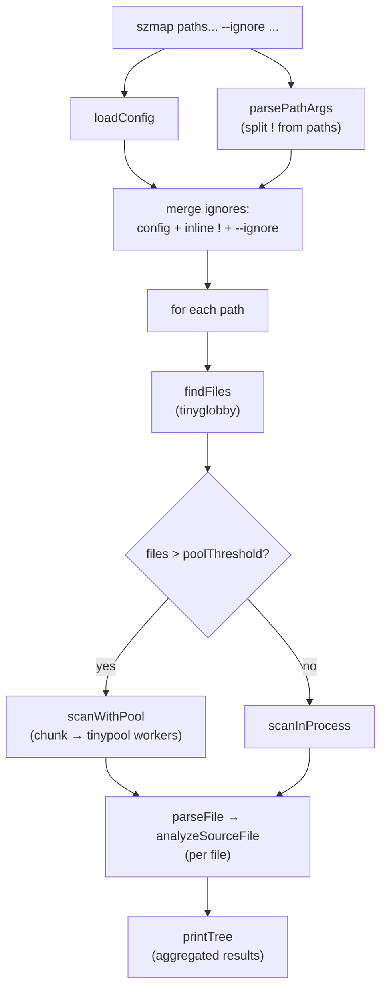

# szmap


A CLI tool for analyzing JavaScript and TypeScript codebases.

## 1. Installation

```bash
npm install -g szmap
```

## 2. Usage

```bash
szmap # defaults to '.' (current directory)
```

Walks the directory recursively, picking up all JS/TS files and ignoring common paths by default (`node_modules`, `dist`, etc.). Shows code metrics per file (lines, functions, classes, methods, interfaces) rendered as a tree.

Example output:

```
$ szmap src

Scanning 1 path...

src
├── commands
│   ├── config.ts — 42 lines, 3 functions, 0 classes, 0 methods, 1 interface
│   └── scan.ts — 68 lines, 5 functions, 1 class, 3 methods, 2 interfaces
├── utils
│   └── logger.ts — 24 lines, 2 functions, 0 classes, 0 methods, 0 interfaces
└── index.ts — 15 lines, 1 function, 0 classes, 0 methods, 0 interfaces

4 files scanned in 89ms
```

### Ignore paths

Exclude paths ad-hoc with `--ignore` / `-i` (glob patterns):

```bash
szmap src --ignore fixtures '**/*.spec.ts'
szmap src -i fixtures
```

Or negate positional arguments with `!` (quote it — most shells expand `!`):

```bash
szmap src '!fixtures' '!**/*.spec.ts'
```

Both forms combine, and they merge on top of `scan.ignore` from your config.

### Multiple paths

```bash
szmap src test
```

Each path is scanned independently and printed as its own tree. Ignore patterns apply to **every** scan root, matched relative to that root — so `--ignore fixtures` will drop `src/fixtures/**` and `test/fixtures/**` alike.

### Config

Open your config file in `$EDITOR`:

```bash
szmap config
szmap c   # alias
szmap cfg # alias
```

The config file lives at the OS-appropriate app-config path and lets you customize include/ignore globs, output colors, and pool tuning.

| Field | Default | Description |
|---|---|---|
| `colors.folder` | `"blue"` | Folder color in the tree output. |
| `colors.metrics` | `"gray"` | Metrics color. Both accept any supported named color. |
| `scan.include` | `["**/*.ts", "**/*.tsx", "**/*.js", "**/*.jsx", "**/*.mjs", "**/*.cjs", "**/*.mts", "**/*.cts"]` | Which files to include (glob patterns). |
| `scan.ignore` | `["**/node_modules/**", "**/dist/**", "**/build/**", "**/coverage/**", "**/.git/**"]` | Which files to ignore (glob patterns). |
| `scan.poolThreshold` | `300` | Minimum number of files before spawning a worker pool. Lower on fast machines, higher on slow ones. |
| `scan.chunkSize` | `100` | How many files each worker processes per task. Larger = less overhead, smaller = better load balancing. |

> [!NOTE]
> If the config file has invalid values, szmap prints a warning and falls back to the defaults for that run. To reset the config file to defaults, run `szmap config -r`.

## 3. Development

### Setup

```bash
git clone https://github.com/jonathanalarcon14/szmap.git
cd szmap
npm install
```

### Run

Run the CLI from source (no build needed, via `tsx`):

```bash
npm run dev -- src
```

### Test

```bash
npm test             # unit tests (fast)
npm run test:watch   # unit tests in watch mode
npm run test:cov     # unit tests + coverage report
npm run test:e2e     # rebuild + end-to-end tests
```

### Lint & format

```bash
npm run lint         # eslint --fix
npm run format       # prettier --write
```

### Build

```bash
npm run build        # emit to dist/
npm start            # run the built CLI
```

## 4. Architecture

### Structure

```
src
├── commands
│   ├── config                  # config subcommand: load, reset, open in $EDITOR
│   │   ├── core                # schema, defaults, path helpers
│   │   └── index.ts            # barrel: registerConfigCommand
│   ├── scan                    # scan subcommand (the default action)
│   │   ├── core                # pipeline stages: find, parse, analyze, run
│   │   ├── output              # tree and per-file renderers
│   │   └── index.ts            # barrel: registerScanCommand
│   └── index.ts                # barrel: register<X>Command entries
└── index.ts                    # CLI entrypoint (commander wiring)
```

`src/index.ts` imports and registers each command exposed by `commands/index.ts`, which in turn only re-exports the `register<X>Command` functions from each subcommand. Everything else (schema, pipeline stages, renderers) stays inside `core/` and `output/` and is not reachable from outside the command.

### Scan flow

> [!NOTE]
> Best viewed on GitHub (or any Markdown renderer with Mermaid support) so the diagram below renders as a flowchart instead of raw code.



- **`parsePathArgs`** — splits positional args into scan paths and `!pattern` ignores.
- **`loadConfig`** — loads the user config lazily inside the action (not at startup), so a broken file doesn't block `szmap config --reset`.
- **merge ignores** — combines `scan.ignore` from config, inline `!` args, and `--ignore` flags into a single list applied per scan root.
- **`findFiles`** — uses [`tinyglobby`](https://github.com/SuperchupuDev/tinyglobby) to walk each root with the merged include/ignore patterns.
- **pool decision** — below `poolThreshold` files, work runs in-process; spawning workers for small scans costs more than it saves.
- **`scanWithPool`** — chunks files (`chunkSize`) and dispatches to a [`tinypool`](https://github.com/tinylibs/tinypool) worker pool; many small chunks let the pool's queue self-balance.
- **`parseFile` → `analyzeSourceFile`** — parses with [`oxc-parser`](https://oxc.rs) and walks the AST to count lines, functions, classes, methods, and interfaces.
- **`printTree`** — builds a tree from the file paths and renders it with ANSI colors from config.

### Testing

```
test
├── config
│   └── *.test.ts       # unit tests for config
├── scan
│   └── *.test.ts       # unit tests for scan (analyze, tree, etc.)
└── e2e
    ├── utils           # fixtures used by e2e tests
    └── *.e2e.test.ts   # spawn the built CLI and assert on its output
```

- `npm test` runs the unit suite only. The Jest `testRegex` uses a negative lookbehind (`.*(?<!\.e2e)\.test\.ts$`) so it skips the slower e2e files.
- `npm run test:e2e` rebuilds the CLI first, then runs `*.e2e.test.ts`. Each e2e test spawns `dist/index.js` as a subprocess against fixtures under `test/e2e/utils/` and asserts on stdout / exit code.

### Adding a command

1. Create `src/commands/foo/` with an `index.ts` that exports a `registerFooCommand(program)` function. Keep implementation details under `core/` (and `output/` if it renders anything).

   ```
   foo
   ├── core           # business logic, types, helpers
   ├── output         # renderers (optional, only if it prints anything)
   └── index.ts       # barrel: registerFooCommand
   ```

2. Re-export it from `src/commands/index.ts`:

   ```ts
   export { registerFooCommand } from './foo';
   ```

3. Wire it up in `src/index.ts` alongside the existing `register<X>Command(program)` calls.

   The barrel in `commands/index.ts` is the only entry point the CLI touches — everything inside `foo/core/` stays private to the command.

4. *(Optional but recommended)* Add tests under `test/foo/` mirroring the source layout — unit tests use `*.test.ts` and cover pieces from `core/` and `output/` directly. For end-to-end coverage, add cases to `test/e2e/app.e2e.test.ts` (or a new `*.e2e.test.ts`) that spawn the built CLI and assert on its stdout.

## License

MIT © Jonathan Alarcón
